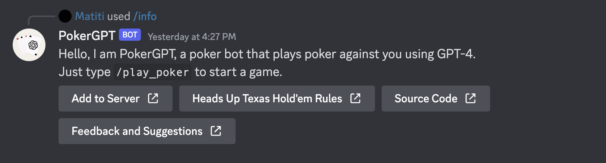
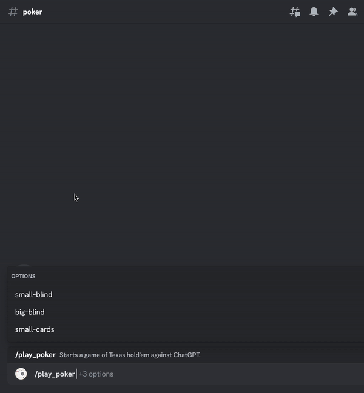
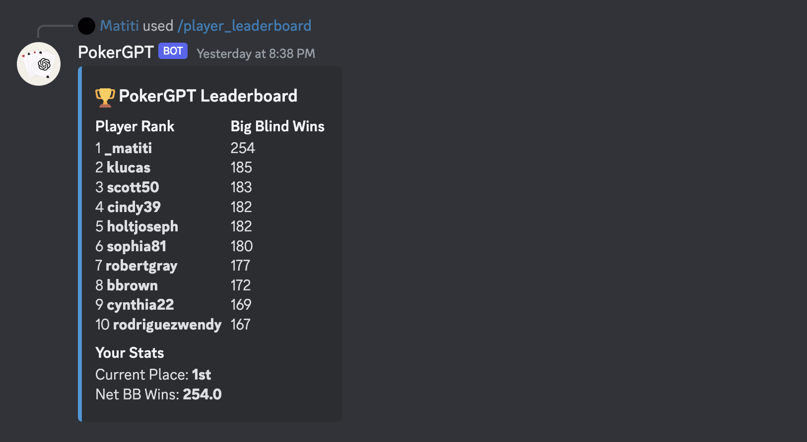
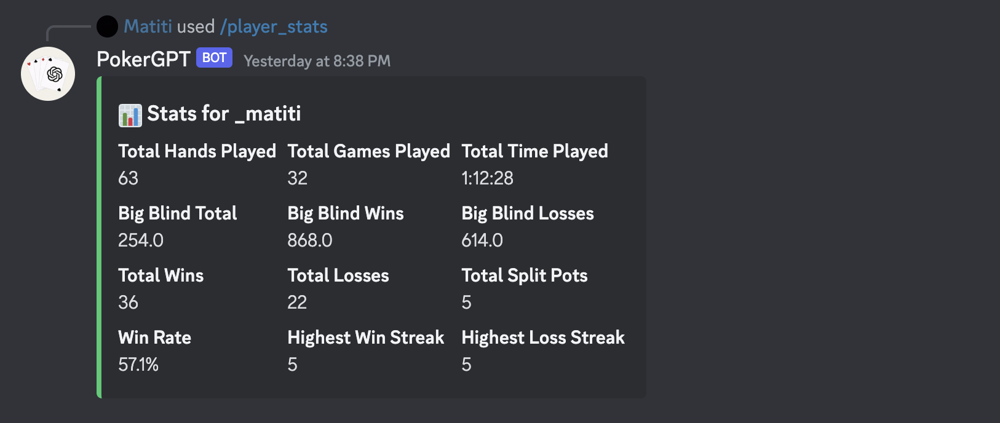
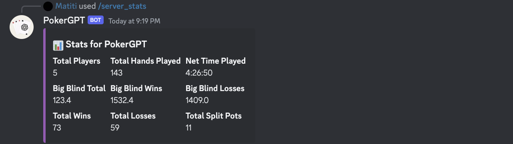

# Poker Discord Bot - ChatGPT

Welcome to the Poker Discord Bot powered by ChatGPT! This bot allows you to play a virtual game of Texas Hold'em poker with your friends right in your Discord server. The bot utilizes the ChatGPT-4 language model developed by OpenAI to provide an interactive and dynamic poker experience. The bot handles all aspects of the game, including dealing cards, managing bets, and determining winners. The bot also incorporates error handling to ensure a smooth user experience. To use the bot in your Discord server, either host the bot yourself using the setup instructions below or use the recomended method and invite the bot to your server using the generated invite link.

## Features

- **Realistic Gameplay**: Play with realistic poker rules, including betting, folding, and raising.
- **Quick startup**: Start a game of Texas Hold'em poker in seconds using the `/play_poker` command.
- **Player Statistics**: View player and server statistics, including win rate, total winnings, and more.
- **Dynamic Gameplay**: The bot handles all aspects of the game, including dealing cards, managing bets, and determining winners.
- **Error Handling**: The bot incorporates error handling to ensure a smooth user experience.
- **Quick Response Times**: The bot responds to user input within seconds.

## Commands

To get information about the bot, use the following command:

`/info`



---

To start a game of Texas Hold'em poker, use the following command:

`/play_poker [small-blind] [big-blind] [small-cards]`

- `small-blind` (optional): Set the small blind amount (default: 5, minimum: 1).
- `big-blind` (optional): Set the big blind amount (default: 10, minimum: 2).
- `small-cards` (optional): Use small cards (default: False).



---

To view the leaderboard for all players, use the following command:

`/player_leaderboard`



---

To view player statistics, use the following command:

`/player_stats [username]`

- `username` (optional): Chose user to view statistics for (default: yourself).



---

To view the leaderboard for all servers, use the following command:

`/server_leaderboard`


---

To view server statistics, use the following command:

`/server_stats [server]`

- `server` (optional): Chose server to view statistics for (default: current server).



## Setup

To set up the PokerGPT Discord Bot yourself, follow these steps:

1. Clone the repository and install dependencies:

    ```bash
    git clone https://github.com/matteo-psnt/PokerGPT.git
    cd PokerGPT
    python3 -m venv .venv
    source .venv/bin/activate
    pip install -r requirements.txt
    ```

2. Create a new Discord application on the [Discord Developer Portal](https://discord.com/developers/applications).
   - Add a bot to your application and copy the bot token.
3. Generate a bot token for your application.
4. Invite the bot to your server using the generated invite link.
5. Create a copy of the `.env_template` file and change the name to `.env`.
6. In the `.env` file, fill in your Discord bot token and OpenAI API key:

    ```plaintext
    DISCORD_TOKEN=your_discord_bot_token
    OPENAI_API_KEY=your_openai_api_key
    ```

7. (Optional) Enable Database Features

    To enable player/server statistics and leaderboards:

    Enter your MySQL credentials in `.env`:

    ```plaintext
    DB_HOST=your_database_host
    DB_USER=your_database_user
    DB_PASSWORD=your_database_password
    DB_NAME=pokerGPTdatabase
    ```

    Initialize the database schema:

    ```bash
    python init_db.py
    ```

8. (Optional) Change the AI Model

    To change the GPT model, edit the model_name variable in `bot/bot_poker_handler.py`.

9. Run the bot:

    ```bash
    python run.py
    ```

    - Use `--no-db` flag to run the bot without database features.

### Card Emoji Setup (For displaying cards in Discord)

1. Create a new Discord server (this will host your card emojis).
2. Add the bot to this server.
3. Upload all images from the `split_deck_images` folder as custom emojis in this server.
4. Get each emoji’s unique identifier:
    - Open `bot/card_display.py` and find the emoji dictionary.
    - In Discord, type each emoji (e.g., `:ace_of_spades:`) to see its identifier, or use a Discord utility bot to fetch emoji IDs.
5. Update the emoji dictionary in `bot/card_display.py` with the correct emoji IDs from your server.
6. Test in a Discord channel to verify the cards display properly.

## Contributions

Contributions to the Poker Discord Bot are welcome! If you have any suggestions, bug reports, or feature requests, please open an issue or submit a pull request on the GitHub repository.

## Disclaimer

This Poker Discord Bot is provided as-is without any warranty. The developers and contributors are not responsible for any loss of virtual currency or damages resulting from the use of this bot.

## License

The Poker Discord Bot is released under the [MIT License](https://opensource.org/licenses/MIT).
